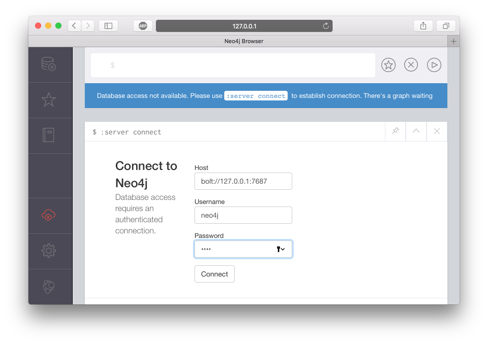
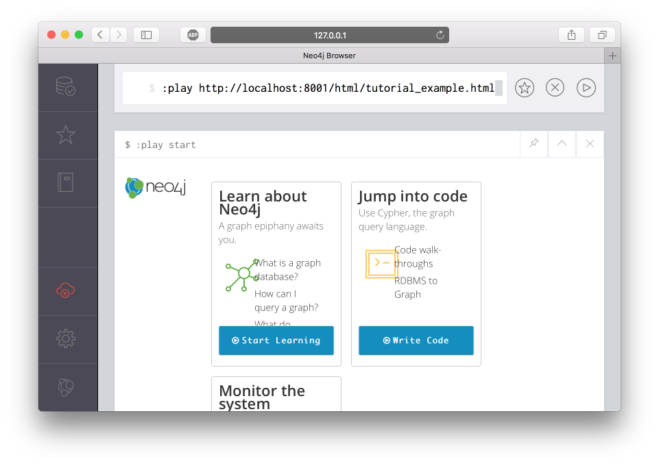
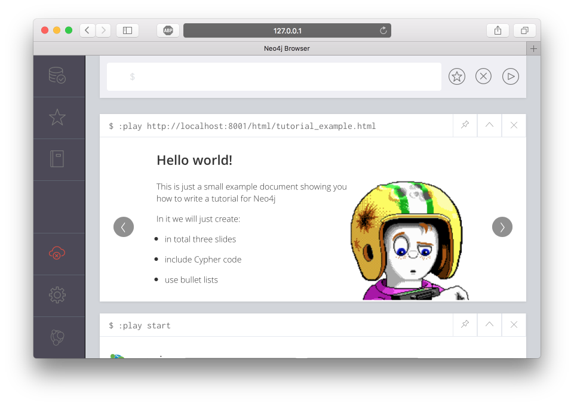

# What is this?

The main content of this repository is a Vagrantfile, which provides you a virtual machine with an Ubuntu Linux (Xenial), a Neo4j (> 3.0), an Asciidoctor setup, and a webserver serving your own Neo4j playbooks, i.e., tutorials.


## Getting started...

  * If not already installed on your machine setup VirtualBox (http://virtualbox.org) and Vagrant (https://www.vagrantup.com/intro/getting-started/install.html).
  * Clone this repository

```
git clone git@github.com:HelgeCPH/neo4j-training.git
```


## Neo4j


After running `vagrant up`, the Neo4j database server is up and running. You can access the webclient in a browser on your host machine on `http://127.0.0.1:7474/browser/`.

The standard login is `neo4j` and the standard password is `demo`.



Now you are up and running with a Neo4j instance


## Running a Local Tutorial

With this repository comes an example tutorial. You can run it by pasting the following into the command field.

```
:play http://localhost:8001/html/tutorial_example.html
```




## Creating your own tutorials

Tutorials are written as Asciidoc documents. You can edit those either on your host machine `./adoc` or on the virtual machine `/synced_folder/adoc`. On the virtual machine is an easy-to-use editor `suplemon` installed, which you might want to use to edit your tutorials.

The Asciidoctor setup is in essence just the one given on https://github.com/neo4j-contrib/developer-resources/blob/gh-pages/resources/guide-create-neo4j-browser-guide/guide-create-neo4j-browser-guide.adoc

Log to the VM
```
vagrant ssh
```

Edit the document
```
suplemon /synced_folder/adoc/tutorial_example.adoc
cd neo4j-guides/

./run.sh /synced_folder/adoc/tutorial_example.adoc html/tutorial_example.html

python3 serve_playbooks.py
```





